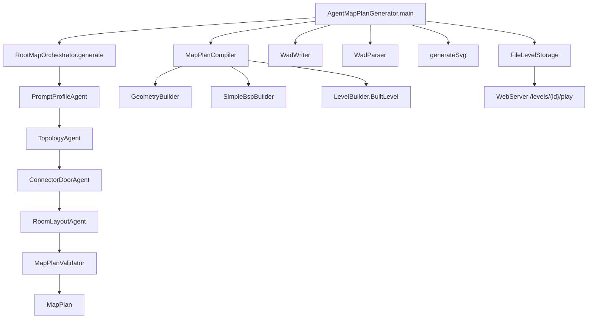

# Doom Map Agent Pipeline

This document describes the current agent implementation in `WADTool/src/agent`.
The pipeline is a deterministic multi-agent planner today. It does not call
Claude, Codex, OpenAI, or Koog during the new map-agent flow.

The older `PromptLevelGenerator` path still contains `KoogPromptProcessor`, but
that is a separate single-room generator and is not used by
`AgentMapPlanGenerator`.

## Entry Points

### `AgentMapPlanGenerator`

Source: `WADTool/src/agent/AgentMapPlanGenerator.kt`

This is the command-line entry point for the current multi-agent flow.

It performs:

1. Read prompt text from a file.
2. Call `RootMapOrchestrator.generate(prompt)`.
3. Write the `MapPlan` JSON.
4. Compile the plan into Doom WAD model objects.
5. Write the PWAD file.
6. Parse the WAD back for verification.
7. Generate an SVG preview.
8. Save prompt, WAD, and SVG into `FileLevelStorage`.
9. Print the browser play URL.

## Call Graph



## Agent Contract

All current planner agents implement:

```kotlin
interface MapSubagent<I, O> {
    val name: String
    fun run(input: I): O
}
```

The agents are plain Kotlin classes. They are currently best understood as
specialized planning tools owned by `RootMapOrchestrator`.

## Agents

### `RootMapOrchestrator`

Source: `WADTool/src/agent/MapAgents.kt`

Role: root coordinator.

Calls:

1. `PromptProfileAgent`
2. `TopologyAgent`
3. `ConnectorDoorAgent`
4. `RoomLayoutAgent`
5. `MapPlanValidator`

Input: raw prompt string.

Output: validated `MapPlan`.

Tools used:

- The five subagents listed above.
- No WAD IO directly.
- No LLM call directly.

### `PromptProfileAgent`

Name: `prompt-profile-agent`

Input: raw prompt string.

Output: `MapPromptProfile`.

Purpose:

- Removes comment lines that start with `#`.
- Infers map title.
- Infers theme: `warehouse`, `hell`, `stone`, or `techbase`.
- Infers difficulty: `easy`, `medium`, or `hard`.
- Infers target room count.
- Detects requested keys: `blue`, `red`, `yellow`.
- Detects set pieces such as bridge, switch, hazard floor, lift, and aisle arena.
- Infers lighting hint: `dark`, `bright`, or `balanced`.

Tools used:

- Kotlin string matching.
- Kotlin regex for explicit room count.
- No external tools or WAD tools.

### `TopologyAgent`

Name: `topology-agent`

Input: `MapPromptProfile`.

Output: partial `MapPlan` with topology and connections.

Purpose:

- Creates required room nodes:
  - `start`
  - `foyer`
  - `hub`
  - one key room per requested key
  - one locked wing per requested key
  - `exit`
- Adds `secret_cache` for the first key route.
- Creates connections from start to foyer, foyer to hub, hub to key rooms, hub to locked wings, and final lock to exit.

Tools used:

- `RoomNode`
- `ConnectionPlan`
- Prompt profile fields from `PromptProfileAgent`.

### `ConnectorDoorAgent`

Name: `connector-door-agent`

Input: partial `MapPlan`.

Output: `MapPlan` with normalized door metadata and loopbacks.

Purpose:

- Ensures locked-door connections carry the correct `requiredKey`.
- Adds return loopbacks from key rooms to the previous landmark.
- Adds return loopbacks from locked wings after the fight.
- De-duplicates connections by `(from, to)`.

Tools used:

- Topology lookup by room id.
- `ConnectionPlan.copy`.
- No geometry or WAD tools.

### `RoomLayoutAgent`

Name: `room-layout-agent`

Input: `MapPlan` with topology and connections.

Output: `MapPlan` with `RoomPlan` layouts.

Purpose:

- Assigns room shape.
- Assigns width and height.
- Assigns floor and ceiling heights.
- Assigns light levels.
- Assigns theme textures.
- Adds encounter, traversal, and landmark hints.

Current room roles handled:

- `start`
- `connector`
- `arena`
- `key_room`
- `locked_room`
- `secret`
- `exit`

Tools used:

- `ThemeTextures.forTheme`.
- Prompt profile fields:
  - theme
  - difficulty
  - lighting hint
  - requested set pieces
- No WAD tools directly.

### `MapPlanValidator`

Name: `map-plan-validator`

Input: full `MapPlan`.

Output: full `MapPlan` with `ValidationReport`.

Purpose:

- Checks that the map has a start room.
- Checks that the map has an exit room.
- Checks that every connection references known rooms.
- Checks that locked connections require keys that actually exist.
- Performs key-aware reachability from the start room.
- Checks that required rooms and exit are reachable.
- Checks that every topology node has a room layout.
- Checks movement-related layout constraints:
  - room width and height are at least 128
  - vertical clearance is at least 80
  - preferred readable light range is 80 to 240
- Emits hard and soft issues.
- Computes a validation score.

Tools used:

- Internal reachability solver.
- `ValidationReport`.
- No WAD tools directly.

## Plan Model

Source: `WADTool/src/agent/MapPlanModels.kt`

Important data types:

- `MapPromptProfile`: normalized prompt intent.
- `MapPlan`: full planning artifact passed between agents.
- `RoomNode`: topological room identity and progression metadata.
- `ConnectionPlan`: graph edge between rooms.
- `RoomPlan`: physical layout intent for a room.
- `ValidationReport`: quality gate output.

The current agents stop at `MapPlan`. WAD geometry is generated afterward by
compiler tools.

## Compiler And WAD Tools

### `MapPlanCompiler`

Source: `WADTool/src/agent/MapPlanCompiler.kt`

Role: converts `MapPlan` into `LevelBuilder.BuiltLevel`.

It is not a `MapSubagent` today, but it acts like the geometry tool after agent
planning.

Calls:

- `placeRooms`: places room rectangles in map space.
- `buildPortals`: creates door/portal definitions between touching rooms.
- `GeometryBuilder`: creates vertices, linedefs, sidedefs, walls, and portals.
- `buildThings`: places player start, keys, exit marker, and simple enemies.
- `buildRoomAnnotations`: creates room-number labels at room centers for SVG previews.
- `SimpleBspBuilder`: creates classic Doom `SEGS`, `SSECTORS`, and `NODES`.

Outputs:

- `vertexes`
- `lineDefs`
- `sideDefs`
- `sectors`
- `things`
- `nodes`
- `subSectors`
- `segs`
- `annotations`

### `GeometryBuilder`

Source: private helper in `MapPlanCompiler.kt`.

Purpose:

- De-duplicates vertices by point.
- Adds two-sided portal linedefs.
- Adds one-sided wall linedefs.
- Splits room wall segments around door intervals.
- Creates sidedefs tied to sector indexes.

### `SimpleBspBuilder`

Source: private helper in `MapPlanCompiler.kt`.

Purpose:

- Creates one subsector per room sector.
- Builds segs from linedefs by sector side.
- Builds a simple recursive BSP tree over room bounds.
- Produces normal Doom BSP lumps for browser/PrBoom compatibility.

### `WadWriter`

Source: `WADTool/src/WadWriter.kt`

Role: writes Doom PWAD files.

Writes these map lumps in order:

1. `MAP01`
2. `THINGS`
3. `LINEDEFS`
4. `SIDEDEFS`
5. `VERTEXES`
6. `SEGS`
7. `SSECTORS`
8. `NODES`
9. `SECTORS`
10. `REJECT`
11. `BLOCKMAP`

Notes:

- Injects a default Player 1 start if missing.
- `REJECT` is currently all zeroes, meaning line of sight may be possible.
- `BLOCKMAP` is conservative and references all linedefs from every block.

### `WadParser`

Source: `WADTool/src/WadParser.kt`

Role: reads generated WADs back into model lists.

Used by:

- `AgentMapPlanGenerator` for post-write verification.
- `generateSvg` for preview generation.

### `generateSvg`

Source: `WADTool/src/SvgGenerator.kt`

Role: creates a top-down SVG preview from parsed WAD geometry.

Used by:

- `AgentMapPlanGenerator`
- Web UI level view routes.

When `AgentMapPlanGenerator` calls this tool, it passes compiler annotations so
the SVG can render numbered room references. These labels are preview metadata;
they are not written into the WAD itself.

### `FileLevelStorage`

Source: `WADTool/src/storage/FileLevelStorage.kt`

Role: stores generated levels under `WADTool/data/levels`.

Stores:

- `prompt.txt`
- `map.svg`
- `map.wad`
- `created.txt`

Used by:

- `AgentMapPlanGenerator`
- `WebServer`

### `WebServer`

Source: `WADTool/src/web/WebServer.kt`

Role: serves generated levels and browser play pages.

Important routes:

- `/levels`: list saved levels.
- `/levels/{id}/view`: SVG preview and play link.
- `/levels/{id}/svg`: raw SVG preview.
- `/levels/{id}/wad`: downloadable WAD.
- `/levels/{id}/pwad`: PWAD endpoint for webDOOM boot script.
- `/levels/{id}/play`: browser play page.
- `/webdoom/*`: local webDOOM runtime files from `WADTool/data/webdoom`.

## Current Runtime Sequence

```text
prompt.txt
  -> AgentMapPlanGenerator
  -> RootMapOrchestrator
  -> PromptProfileAgent
  -> TopologyAgent
  -> ConnectorDoorAgent
  -> RoomLayoutAgent
  -> MapPlanValidator
  -> map_plan.json
  -> MapPlanCompiler
  -> WadWriter
  -> WadParser
  -> generateSvg
  -> FileLevelStorage
  -> WebServer
  -> webDOOM
```

## Current Limitations

- Agents are deterministic Kotlin classes, not autonomous LLM agents.
- There is no separate floor, bridge, lighting, item, monster, or button agent yet.
- `RoomLayoutAgent` stores traversal and encounter intent as hints, but
  `MapPlanCompiler` implements only basic rectangular room geometry today.
- `SimpleBspBuilder` is intentionally minimal. It is enough for browser play,
  but it is not a full node builder like ZenNode, ZDBSP, or glBSP.
- `BLOCKMAP` is conservative, so it favors correctness over performance.

## Suggested Next Agent Splits

These are not implemented yet, but they fit the current architecture:

- `FloorTraversalAgent`: hazard floors, stairs, jumps, bridges, and passability.
- `LightingAgent`: sector light gradients, key-lighting, secrets, and contrast.
- `EncounterAgent`: monsters, ammo, health, pressure pacing, and difficulty.
- `DoorActionAgent`: locked doors, switch doors, exit specials, tags, and linedef actions.
- `DecorationAgent`: pillars, shelves, cover, landmarks, and readable silhouettes.
- `QualityJudgeAgent`: post-compile metrics such as reachability, softlocks, room scale, sightlines, and item balance.
